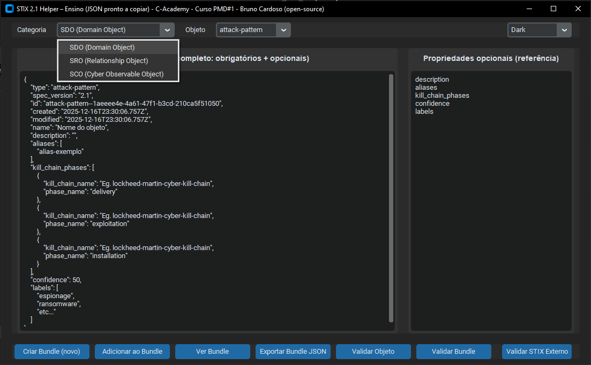

# STIX 2.1 Helper – Ensino / Teaching Tool

**Autor / Author:** Bruno Cardoso  \
**Curso / Course:** C-Academy – PMD#1  \
**Repositório / Repository:** https://github.com/brunomac69/stixlab  \
**Licença / License:** Open Source  \
**Linguagem / Language:** Python 3.x

---

## 🇵🇹 Descrição (PT)

Esta aplicação gráfica (GUI), desenvolvida com **CustomTkinter (CTk)**, foi criada para apoiar o **ensino e a prática de criação de objetos STIX 2.1**.

O objetivo é permitir a formandos e analistas compreender facilmente a estrutura dos diferentes tipos de objetos (**SDO, SRO e SCO**) e gerar **JSONs prontos a utilizar**, com valores predefinidos didáticos e compatíveis com a norma **STIX 2.1**.

A ferramenta também permite criar **bundles STIX**, adicionar múltiplos objetos e exportar o resultado final para um ficheiro JSON compatível.

---
## Build executavel
Build Executavel disponivel em (dist/STIX_2.1_Helper.exe)

## 📸 Screenshot



> Exemplo da interface gráfica da aplicação STIX 2.1 Helper em execução.

---

## 🇵🇹 Funcionalidades Principais

- Interface moderna em **CustomTkinter** (modos *Dark*, *Light* e *System*).
- Suporte para:
  - **SDO (STIX Domain Objects)**  \
    `attack-pattern`, `campaign`, `course-of-action`, `grouping`, `identity`, `indicator`, `infrastructure`, `intrusion-set`, `location`, `malware`, `malware-analysis`, `note`, `observed-data`, `opinion`, `report`, `threat-actor`, `tool`, `vulnerability`
  - **SRO (STIX Relationship Objects)**  \
    `relationship`, `sighting`
  - **SCO (STIX Cyber Observable Objects)**  \
    `ipv4-addr`, `ipv6-addr`, `domain-name`, `url`, `email-addr`, `mac-addr`, `mutex`, `file`, `process`, `user-account`, `network-traffic`

- Geração automática de:
  - `id` com UUIDs válidos (`<type>--<uuid>`)
  - Timestamps em **ISO 8601 UTC** (`created`, `modified`, `first_seen`, `last_seen`, `published`, `valid_from`, `first_observed`, `last_observed`, etc.)
  - Campos opcionais com listas ilustrativas (`aliases`, `kill_chain_phases`, `labels`, `malware_types`, `tool_types`, `threat_actor_types`, etc.)

- Criação e gestão de **bundles STIX 2.1**:
  - Criar novo bundle vazio
  - Adicionar objetos STIX ao bundle
  - Visualizar o bundle atual em JSON
  - Exportar bundle para ficheiro `.json`

- Código facilmente extensível para novos tipos de objetos STIX.

---


## 🇵🇹 Pré-requisitos

- **Python 3.10** ou superior
- Dependências:

```bash
pip install customtkinter
pip install stix2-validator
```

As restantes bibliotecas (`uuid`, `json`, `datetime`, `tkinter`) fazem parte da **biblioteca padrão do Python**.

---

## 🇵🇹 Como usar

1. Clonar o repositório + venv + instalar requirements.txt :

```bash
git clone https://github.com/brunomac69/stixlab.git
cd stixlab
python -m venv venv
Windows: venv\Scripts\activate
Linux: source venv/bin/activate
pip install -r requirements.txt
```

2. Certificar que o script principal se chama `main.py` (ou ajustar o nome conforme necessário).

3. Executar a aplicação:

```bash
python main.py
```

4. Na interface gráfica:
- Selecionar a **Categoria** (SDO, SRO ou SCO)
- Selecionar o **Objeto STIX** na segunda *combobox*
- Painel esquerdo: JSON completo (campos obrigatórios + opcionais)
- Painel direito: lista de campos opcionais para referência

5. Botões inferiores:
- **Criar Bundle (novo)** – inicia um bundle STIX vazio
- **Adicionar ao Bundle** – adiciona o objeto atual ao bundle
- **Ver Bundle** – abre uma nova janela com o bundle em JSON
- **Exportar Bundle JSON** – guarda o bundle num ficheiro `.json`

5. **Modo CLI (Linha de Comandos)**:
   - Para validar um ficheiro STIX existente sem abrir a interface gráfica:
   ```bash
   python main.py -v <caminho_para_ficheiro.json>
   # ou
   python main.py --validate <caminho_para_ficheiro.json>
   ```

   - Para gerar uma imagem (grafo) do ficheiro STIX:
   ```bash
   python main.py -i <caminho_para_ficheiro.json>
   # Gera <caminho_para_ficheiro.json>.png
   ```

---

## 🇵🇹 Exemplo de objeto `malware`

```json
{
  "type": "malware",
  "spec_version": "2.1",
  "id": "malware--<uuid>",
  "created": "2025-12-16T20:51:00Z",
  "modified": "2025-12-16T20:51:00Z",
  "name": "Nome do objeto",
  "is_family": false,
  "description": "",
  "malware_types": [],
  "aliases": [],
  "first_seen": "2025-12-16T20:51:00Z",
  "last_seen": "2025-12-16T20:51:00Z",
  "capabilities": [],
  "confidence": 50,
  "labels": ["espionage", "ransomware", "etc..."]
}
```

---

## 🇬🇧 Description (EN)

This GUI application, built with **CustomTkinter (CTk)**, is designed to support **teaching and practicing the creation of STIX 2.1 objects**.

It helps students and analysts understand the structure of different object types (**SDO, SRO and SCO**) and generate **ready-to-use JSON**, with educational default values aligned with the **STIX 2.1 specification**.

The tool also allows creating **STIX bundles**, adding multiple objects, and exporting the final result to a compatible JSON file.

---

## 🇬🇧 Main Features

- Modern **CustomTkinter** interface (Dark, Light and System themes)
- Support for SDO, SRO and SCO objects
- Automatic UUID-based IDs and ISO 8601 UTC timestamps
- Educational default values for optional properties
- STIX 2.1 bundle creation, visualization and export
- **CLI Mode for Validation**: Validate STIX files directly from the command line (`python main.py -v file.json`)
- **CLI Graph Visualization**: Generate a PNG image of your STIX objects (`python main.py -i file.json`)
- Easily extensible codebase

---

## 🇬🇧 Requirements

- **Python 3.10+**
- Dependency:

```bash
pip install customtkinter
pip install stix2-validator
 or
pip install -r requirements.txt

```

---

## 🇬🇧 How to Clone + venv + Requirements + Run

```bash
git clone https://github.com/brunomac69/stixlab.git
cd stixlab
python -m venv venv
Windows: venv\Scripts\activate
Linux: source venv/bin/activate
pip install -r requirements.txt
python main.py
```

---

## 📜 Licença / License

Este projeto é **open-source** e pode ser reutilizado para fins de ensino e aprendizagem, desde que seja mencionada a autoria original.

This project is **open-source** and may be reused for teaching and learning purposes, provided original authorship is credited.

---

## 👨‍🏫 Créditos / Credits

**Bruno Cardoso + LLM 🙂**  \
C-Academy | Curso PMD#1

- LinkedIn: https://www.linkedin.com/in/brunocardoso-cybersecurity/
- GitHub: https://github.com/brunomac69

